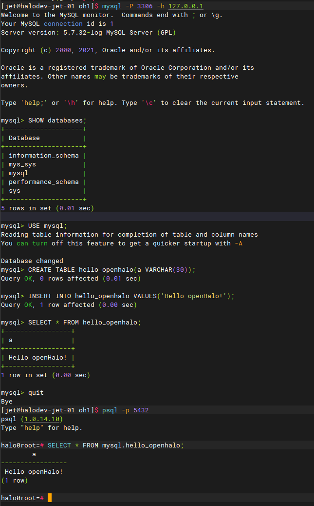

# Documentation : Installation et configuration d’OpenHalo


## Pré-requis

Il faut posséder un environnement Linux. Par exemple, sur Windows il est possible de télécharger WSL en ouvrant PowerShell en administrateur : 
```bash
wsl –-install
```
Par défaut, un terminal Linux, Ubuntu, sera installé.

Maintenant, il faut ouvrir un terminal Linux, le mettre à jour et installer les outils nécessaires à l’installation d’OpenHalo : 
```bash
sudo apt-get update
sudo apt install build-essential gcc g++ make cmake autoconf uuid-dev libicu-dev zlib1g-dev libreadline-dev -y
```
Ainsi un compilateur C et les librairies nécessaires ont été installées.

Il faut également posséder MySQL client. Voici comment l’installer : 
```bash
sudo apt install mysql-client-core-8.0
```

## Téléchargement et compilation d’OpenHalo

Désormais, il faut cloner les données d’OpenHalo présentes sur GitHub : 
```bash
git clone https://github.com/HaloTech-Co-Ltd/openHalo.git
```

Les données sont cloner sur l’ordinateur. Il faut maintenant installer depuis le code source, et il faut se placer dans le dossier openHalo : 
```bash
cd openHalo
./configure --prefix=/home/halo/openhalo/1.0 --enable-debug --with-uuid=ossp --with-icu CFLAGS=-O2
```
Cette ligne a préparé la compilation et a vérifié les bibliothèques.
La compilation et l’installation se font avec : 
```bash
make && make install
```

Pour compiler les modules supplémentaires, il faut se placer dans le dossier contrib : 
```bash
cd contrib
make && make install
```

## Configuration du serveur

Il faut créer le groupe halo avec l’identifiant ID 1000 : 
```bash
groupadd -g 1000 halo
```
Si l’ID est déjà pris, il est possible d’en prendre un autre : 
```bash
groupadd -g 1500 halo
```
Il faut ensuite ajouter l’utilisateur halo au bon ID : 
```bash
useradd -u 1000 -g halo halo
```
Pour vérifier ces créations : 
```bash
id halo est censé donner uid=1000(halo) gid=1000(halo) groups=1000(halo)
```

Il est préférable d’utiliser OpenHalo avec l’utilisateur halo.
Pour cela, il faut se placer en tant qu’halo avec : 
```bash
su - halo
```
(Si un mot de passe est demandé, il faut le créer préalablement avec passwd halo)

Il faut maintenant préparer les variables d’environnement. 
Il faut créer un dossier pour les sockets :
```bash 
mkdir /var/run/openhalo
chown halo:halo /var/run/openhalo
```

Ensuite, il faut définir les variables d’environnement qui permettent au shell de savoir où sont les binaires d’OpenHalo, où se trouvent les données, et comment trouver les librairies.
Pour cela, il est préférable de modifier le fichier ~/.bashrc : 
Pour l’ouvrir : 
```bash
nano ~/.bashrc
```
Maintenant il faut ajouter les lignes suivantes au fichier : 
```bash
export HALO_HOME=/home/halo/openhalo/1.0
export PGDATA=/home/halo/ohdata
export PATH=$HALO_HOME/bin:$PATH
export LD_LIBRARY_PATH=$HALO_HOME/lib:$LD_LIBRARY_PATH
export PGHOST=/var/run/openhalo
alias pg_ctl='/home/halo/openhalo/1.0/bin/pg_ctl -D /home/halo/ohdata'
```
Pour enregistrer les modifications : Ctrl+O, puis Entrée et quitter avec Ctrl+X
Pour appliquer les changements : 
```bash
. ~/.bashrc
```
Il est possible de vérifier : 
```bash
echo $PATH
echo $PGDATA
which pg_ctl
```
Cette dernière ligne doit afficher /home/halo/openhalo/1.0/bin/pg_ctl

## Initialisation de la base de données

Il faut initialiser la base de données avec cette commande : 
```bash
pg_ctl init -D $PGDATA
```

L’environnement du serveur a bien été configuré, maintenant il est possible de regarder le statut, de lancer, arrêter ou relancer le serveur : 
```bash
pg_ctl status
pg_ctl start
pg_ctl restart
pg_ctl stop
```

## Configuration de OpenHalo/PostgreSQL

Pour cela, il faut modifier le fichier postgresql.conf.
Pour l’ouvrir : 
```bash
nano $PGDATA/postgresql.conf
```
Dans ce fichier, il faut ajouter, modifier ou enlever le # commentaire de ces lignes : 
```bash
listen_addresses = '*'
port = 5432
database_compat_mode = 'mysql'
mysql.listener_on = true
mysql.port = 3306
```
Pour enregistrer puis quitter : Ctrl+O, puis Entrée et Ctrl+X

De même, il faut modifier le fichier pg_hba.conf.
Pour l’ouvrir : 
```bash
nano $PGDATA/pg_hba.conf
```
Dans ce fichier, il faut ajouter, modifier ou enlever le # commentaire de ces lignes : 
```bash
# IPv4 local connections:
host    all             all             127.0.0.1/32            trust
host    all             all             0.0.0.0/0                     md5
```
Pour enregistrer puis quitter : Ctrl+O, puis Entrée et Ctrl+X

Maintenant, il est possible de relancer le serveur : 
```bash
pg_ctl restart
```
Pour vérifier si ça tourne : 
```bash
pg_ctl status
```

## Activation de l’extension MySQL

Il faut se connecter à PostgreSQL : 
```bash
psql -p 5432
```
Dans cette interface : 
```bash
CREATE EXTENSION aux_mysql CASCADE;
```
Puis il faut créer un utilisateur pour MySQL : 
```bash
SET password_encryption = 'mysql_native_password';
CREATE USER test PASSWORD 'test';
SELECT * FROM pg_shadow WHERE usename='test';
```
Ensuite, il faut quitter psql : 
```bash
\q
```

Maintenant, il est possible de tester la connexion MySQL : 
```bash
mysql -P 3306 -h 127.0.0.1
```
Le mot de passe est test.
Pour quitter mysql :
```bash
\q
```

Voici des tests pour comprendre comment le lien entre MySQL et PostgreSQL se fait : 



## Vérification finale

Pour voir si PostgreSQL écoute bien sur 5432 et MySQL listener sur 3306
```bash
pg_ctl status
ss -tlnp | grep 5432
ss -tlnp | grep 3306
```

## Arrêt et redémarrage du serveur OpenHalo

Quand la session est finie, il faut arrêter PostgreSQL/OpenHalo : 
```bash
pg_ctl stop
```
Puis vérifier l’état et si le serveur n’écoute plus : 
```bash
pg_ctl status
ss -tlnp | grep 5432
ss -tlnp | grep 3306
```

Lors d’une prochaine utilisation, il faut tout d’abord ouvrir une session avec l’utilisateur halo : 
```bash
su - halo
```
Recharger les variables d’environnement : 
```bash
.~/.bashrc
```
Lancer le serveur et vérifier l’état : 
```bash
pg_ctl start
pg_ctl status
```
Une fois le serveur lancé, il est possible d’accéder à PostgreSQL : 
```bash
psql -p 5432
```
Et à MySQL (mot de passe test): 
```bash
mysql -P 3306 -h 127.0.0.1 
```

## Création d’autres utilisateurs

Il est aussi possible de créer d’autres utilisateurs MySQL compatibles dans PostgreSQL : 
```bash
psql -p 5432
SET password_encryption = mysql_native_password;
CREATE USER nom PASSWORD 'mon_mot_de_passe';
CREATE DATABASE projetdb OWNER nom;
\q
mysql -P 3306 -h 127.0.0.1 -unom -p
```

## Chargement d’une base de données PostgreSQL dans OpenHalo

Si l’on veut charger une base de données en PostgreSQL (par exemple fichier.sql) : 
```bash
psql -p 5432 -U halo -d postgres -f chemin/vers/backup.sql
```